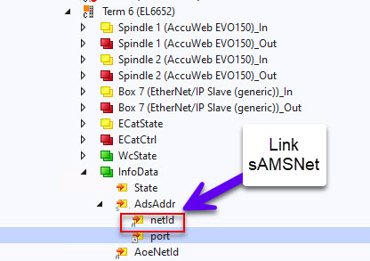
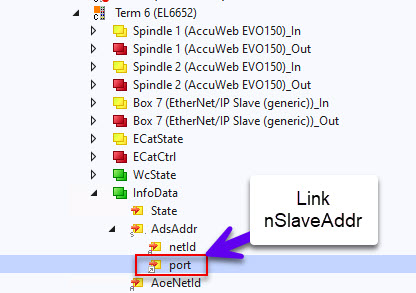

# **Preco EtherCAT Device State Change FB Documentation**  
## Version 1.0.0

## **Installation**
Use Tc2_EtherCAT Library

## Main Function Block Declarations
```js
FUNCTION_BLOCK FB_SetSlaveState

VAR_INPUT
    sAMSNet     AT %I*    : AMSNETID;   // Linked to EtherCAT master
    nSlaveAddr  AT %I*    : UINT;       //  Linked to PortID of slave device
END_VAR

VAR_OUTPUT
    CurrState           : ST_EcSlaveState;
END_VAR
VAR
    fbSetECSlaveState   : Tc2_EtherCAT.FB_EcSetSlaveState;
    fbGetECSlaveState   : Tc2_EtherCAT.FB_EcGetSlaveState;
    nState              : UINT;
    sNetId              : T_AmsNetId; // Must have a value

END_VAR
```
<div style="page-break-after: always;"></div>

## Methods

### <div style="color: #00ffff"><div style="color: #008000">SetState</div></div>

#### Description
Sets Slave to the requested state of slaves state machine.
Call the SetState Method with the state to goto.

| Value   | State      |
| :----:  | :----:     |
| 1       | INIT       |
| 2       | PREOP      |
| 3       | BOOTSTRAP  |
| 4       | SAFEOP     |
| 8       | OP         |

<div style="page-break-after: always;"></div>

#### Declarations
```js
METHOD SetState : BOOL
VAR_INPUT
    reqState    : WORD; // Holds the state the device will be set to
    tTimeout    : TIME := T#10S; // Timeout time for ECSetSlaveState FB
END_VAR

```
#### Code
```js
SetState := FALSE;
CASE nState OF
0:
   sNetID := F_CreateAmsNetId( sAMSNet ); // Convert linked EtherCAT Master AMS address and convert to string format FB's can use.
   nState := 1;

1:
   // Set the slave to the state requested to goto	
   fbSetECSlaveState(
	sNetId:= sNetId, 
	nSlaveAddr:= nSlaveAddr, // Linked port  
	bExecute:= TRUE , 
	tTimeout:= tTimeout , 
	reqState:= reqState); // State requested to goto
    nState := nState + 1; // Goto next state
2:
  
  fbSetECSlaveState( bExecute := FALSE); // Reset the execute flag of set slave state
  // Check the set slave state has completed without errors
  IF (NOT fbSetECSlaveState.bBusy) AND (NOT fbSetECSlaveState.bError) THEN
	 // Get slave current state so we can check it changed to the requested state
	 fbGetECSlaveState(
		sNetId:= sNetId , 
		nSlaveAddr:= nSlaveAddr, 
		bExecute:= TRUE, 
		tTimeout:= tTimeout);
		nState := 3; // Goto next state
  END_IF
  
3:  
	fbGetECSlaveState(bExecute := FALSE, state=> CurrState ); // Reset the execute flag of get slave state
	// Check get slave state has completed without errors
	IF (NOT fbGetECSlaveState.bBusy) AND (NOT fbGetECSlaveState.bError) THEN
		nState := 4; // Move on
	END_IF
4:
	// Compare requested state with actual state
	CASE (reqState) OF
		  1:
		  	IF CurrState.deviceState = Tc2_EtherCAT.EC_DEVICE_STATE_INIT THEN
		  	    nState := 5; // Move to completed state
			END_IF;
		  2:
		  	IF CurrState.deviceState = Tc2_EtherCAT.EC_DEVICE_STATE_PREOP THEN
		  	    nState := 5; // Move to completed state
			END_IF;
          4:
		  	IF CurrState.deviceState = Tc2_EtherCAT.EC_DEVICE_STATE_SAFEOP THEN
		  	    nState := 5; // Move to completed state
			END_IF;
		  8:
		  	IF CurrState.deviceState = Tc2_EtherCAT.EC_DEVICE_STATE_OP THEN
		  	    nState := 5; // Move to completed state
			END_IF;
	  END_CASE
5:
   // All complete so reset flags
   SetState := TRUE;
   nState := 0;

100:
   ;                     // Error handling..
END_CASE
```
#### **<div style="color: #ff8c00">Usage Example</div>**

#### Declarations
```js
    fbSetSlaveState : FB_SetSlaveState;
```
#### Code
```js
//Set to Init
IF fbSetSlaveState.SetState(1,T#1S) THEN
    ;
END_IF
```
<div style="page-break-after: always;"></div>

### <div style="color: #00ffff"><div style="color: #008000">GetState</div></div>

#### Description
Gets Slave current state.


#### Declarations
```js
METHOD SetState : BOOL
VAR_INPUT
    tTimeout    : TIME := T#10S; // Timeout time for ECSetSlaveState FB
END_VAR

```
#### Code
```js
GetState := FALSE;
CASE nState OF
0:
    sNetID := F_CreateAmsNetId( sAMSNet ); // Convert linked EtherCAT Master AMS address and convert to string format FB's can use.
    nState := 1;

1:
  
    // Get slave current state so we can check it changed to the requested state
    fbGetECSlaveState(
        sNetId:= sNetId , 
        nSlaveAddr:= nSlaveAddr, 
        bExecute:= TRUE, 
        tTimeout:= tTimeout);
    nState := 2; // Goto next state
  
2:  
    fbGetECSlaveState(bExecute := FALSE, state=> _CurrentState ); // Reset the execute flag of get slave state
    // Check get slave state has completed without errors
    IF (NOT fbGetECSlaveState.bBusy) AND (NOT fbGetECSlaveState.bError) THEN
        nState := 3; // Move on
    END_IF
3:
    // All complete so reset flags
    GetState := TRUE;
    nState := 0;

100:
   ;                     // Error handling..
END_CASE
```

#### **<div style="color: #ff8c00">Usage Example</div>**

#### Declarations
```js
    fbSetSlaveState : FB_SetSlaveState;
```
#### Code
```js
IF fbGetSlaveState.GetState(T#2S) THEN
    ;
END_IF
```

### <div style="color: #00ffff"><div style="color: #008000">ResetStateToOp</div></div>

#### Description
Takes Slave to Init and back to Op.

#### Declarations
```js
METHOD ResetStateToOp : BOOL
VAR_INPUT
    tTimeout    : TIME := T#10S; // Timeout time for ECSetSlaveState FB
END_VAR

```
#### Code
```js
ResetStateToOp := FALSE;
CASE nState OF
0:
   sNetID := F_CreateAmsNetId( sAMSNet ); // Convert linked EtherCAT Master AMS address and convert to string format FB's can use.
   nState := 1;

1:
   // Set the slave to the state requested to goto	
   fbSetECSlaveState(
	sNetId:= sNetId, 
	nSlaveAddr:= nSlaveAddr, // Linked port  
	bExecute:= TRUE , 
	tTimeout:= tTimeout , 
	reqState:= 1); // State requested to init
    nState := nState + 1; // Goto next state
2:
  
  fbSetECSlaveState( bExecute := FALSE); // Reset the execute flag of set slave state
  // Check the set slave state has completed without errors
  IF (NOT fbSetECSlaveState.bBusy) AND (NOT fbSetECSlaveState.bError) THEN
	 // Get slave current state so we can check it changed to the requested state
	 fbGetECSlaveState(
		sNetId:= sNetId , 
		nSlaveAddr:= nSlaveAddr, 
		bExecute:= TRUE, 
		tTimeout:= tTimeout);
		nState := 3; // Goto next state
  END_IF
  
  IF fbSetECSlaveState.bError THEN
	  nState := 100;
  END_IF
  
3:  
	fbGetECSlaveState(bExecute := FALSE, state=> _CurrentState ); // Reset the execute flag of get slave state
	// Check get slave state has completed without errors
	IF (NOT fbGetECSlaveState.bBusy) AND (NOT fbGetECSlaveState.bError) THEN
		nState := 4; // Move on
	END_IF
	
4:
	// Make sure in correct state
  	IF _CurrentState.deviceState = Tc2_EtherCAT.EC_DEVICE_STATE_INIT THEN
  	    nState := 5; // Move to completed state
	END_IF;
	
5:
	// Set the slave to the state requested to goto	
   fbSetECSlaveState(
	sNetId:= sNetId, 
	nSlaveAddr:= nSlaveAddr, // Linked port  
	bExecute:= TRUE , 
	tTimeout:= tTimeout , 
	reqState:= 8); // State requested to OP
    nState := nState + 1; // Goto next state
	
6:
	fbSetECSlaveState( bExecute := FALSE); // Reset the execute flag of set slave state
  	// Check the set slave state has completed without errors
  	IF (NOT fbSetECSlaveState.bBusy) AND (NOT fbSetECSlaveState.bError) THEN
		// Get slave current state so we can check it changed to the requested state
	 	fbGetECSlaveState(
			sNetId:= sNetId , 
			nSlaveAddr:= nSlaveAddr, 
			bExecute:= TRUE, 
			tTimeout:= tTimeout);
			nState := 7; // Goto next state
  	END_IF
  
	IF fbSetECSlaveState.bError THEN
		nState := 100;
  	END_IF
	
7:  
  	fbGetECSlaveState(bExecute := FALSE, state=> _CurrentState ); // Reset the execute flag of get slave state
	// Check get slave state has completed without errors
	IF (NOT fbGetECSlaveState.bBusy) AND (NOT fbGetECSlaveState.bError) THEN
		nState := 8; // Move on
	END_IF
	
8:
	// Compare requested state with actual state
  	IF _CurrentState.deviceState = Tc2_EtherCAT.EC_DEVICE_STATE_OP THEN
  	    nState := 9; // Move to completed state
	END_IF;
	
9:
   // All complete so reset flags
   ResetStateToOp := TRUE;
   nState := 0;

100:
   ;                     // Error handling..
END_CASE
```

#### **<div style="color: #ff8c00">Usage Example</div>**

#### Declarations
```js
    fbSetSlaveState : FB_SetSlaveState;
    _bResetToOP     : bool;
```
#### Code
```js
IF _bResetToOP THEN
    IF fbSetSlaveState.ResetStateToOp(T#3S) THEN
        _bResetToOP := FALSE;
    END_IF
END_IF;
```
#### **<div style="color: #fe1c00">Variable Linking</div>**


 
<div style="page-break-after: always;"></div>

## Properties

### <div style="color: #00ffff"><div style="color: #008000">CurrentState</div></div>
#### Description
Holds the current state after a GetState or SetState Method is run

Get only is implemented..